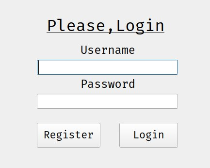
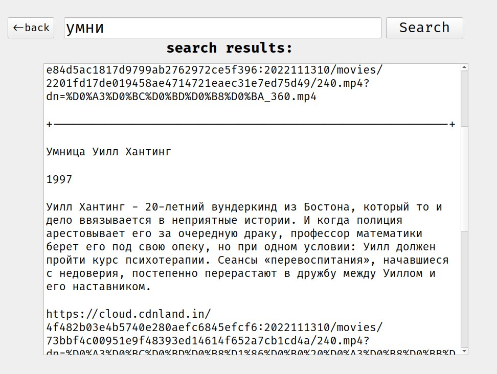

# Films Downloader

This program helps downloading and watching films online without ads and other junk.

## Idea Description

Idea of this program is to help users watching films easily

## Installation

```sh
pip install -r requrements.txt
```

## Requrements

+ pyqt5
+ pysqlite3
+ undetected_chromedriver
+ selenium
+ beautifulsoup4
+ requests
+ lxml
+ fake_useragent
+ importlib_metadata

## Implementation description

If you dont have films database program will parse: title, description, release year, description and link to the film. When you will search for film program will search for its title or description in films database. When it will parse all direct links to all films that were searched. When you would be able to watch films through direct links to them.

## Features

+ Accounts and search history
* Case insensitve search
    + Search by title
    + Search by description
+ Random search
+ Films database generator

## Screenshots

#### Login Manager



#### Main Window


#### Search Window


